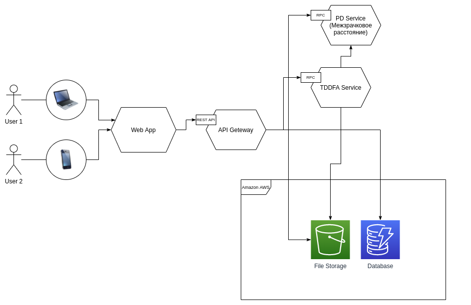

# Virtual Try-On Service
Сервис для виртуальной примерки оправ

## Схема сервисов


### Инструкция по расширению микросервисов (XYZ-axis)
- TDDFA Service и PD Service не хранят вообще никаких данных и производят очень много вычислений, поэтому их можно масташбировать по оси X с load балансером.
- File Storage и Database хранят данные по ключам, их можно масташбировать по оси Z согласно первому символу ключа.
- При необходимости API Geteaway тоже можно масташбировать по оси X.
- По оси Y мы уже находимся наверху, можно перейти к монолиту и спуститься вниз.

## Базы данных
- [Сравнение реляционных баз данных](./docs/SQL.md)

## Развертывание базы данных
```sh
docker-compose up
```